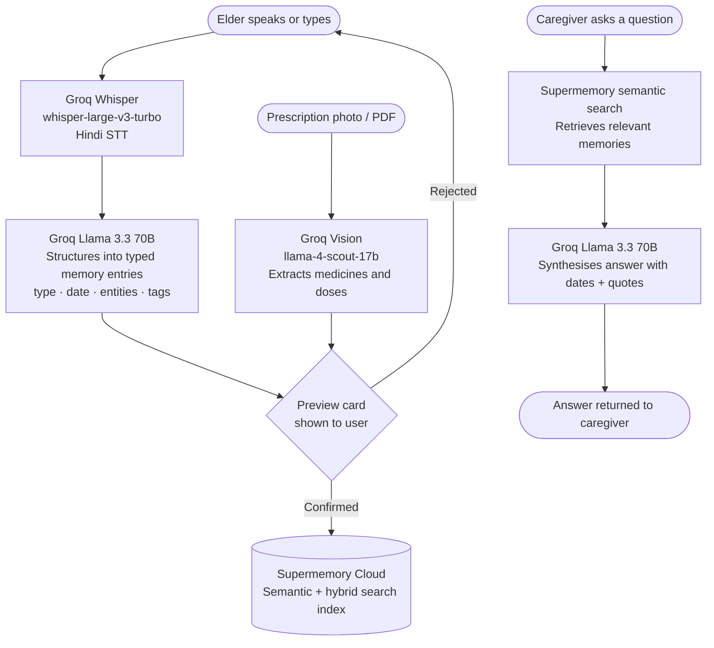

# Smriti — Dadi Ka Health Saathi

> *"Mummy ko chakkar aa raha tha aaj — yaad rakhna."*
> One voice note. Three lives connected.

Smriti is a **voice-first health memory app** for ageing parents in India and the adult children who care for them from afar. Dadi speaks in Hindi. AI structures it. Beti in Mumbai sees it instantly. The doctor gets a clean summary.

**Live app:** https://smriti-health-companion.onrender.com
**Telegram bot:** [@SmritiHealthBot](https://web.telegram.org/k/#@SmritiHealthBot)
**Build screencast:** https://www.loom.com/share/f6fe1c9af4114ef2beac02f61ad1bc37

---

## The Problem

India has 140 million people over 60. Most live apart from their adult children. Every family knows this pattern:

- Papa had a fall — nobody remembered until the next visit three months later
- Dadi's BP has been high for weeks — nobody connected the dots
- "What did the doctor say about her knee?" — nobody wrote it down

Smriti is a persistent memory for health moments — captured automatically when you speak, recalled instantly when you ask.

---

## Who It's For

| Role | What they do |
|---|---|
| **Elder (Dadi / Papa)** | Speaks or types a health note in Hindi or English. No login required. |
| **Caregiver (Beti / Beta)** | Opens the family dashboard from any city. Sees flags, urgency level, and the full timeline. |
| **Doctor** | Receives a structured chronological summary before the appointment. |

---

## Key Features

| Feature | Description |
|---|---|
| Voice check-in | Speak in Hindi or English — Groq Whisper transcribes, Llama structures, memory saved |
| Prescription scan | Upload a photo or PDF — AI extracts medicine names, doses, and frequencies |
| Ask anything | Natural language questions answered from saved memories with exact dates and quotes |
| Family dashboard | Caregiver view: urgency level, active flags, recent timeline, weekly pattern summary |
| Telegram bot | `/start`, voice note, text note, `/ask` — works on any phone, no app download |
| Emergency alert | One tap logs an emergency memory and fires an email to the caregiver |
| Recurring patterns | AI detects repeated symptoms or missed medicines across the last 14 days |
| Per-person isolation | Each person's memories are fully separate — Mummy and Papa never mix |

---

## AI Pipeline



**Safety guardrail:** every Llama prompt includes a strict system rule — *"You are not a medical adviser. Never diagnose, recommend doses, or make urgency judgments."*

---

## Try It in 60 Seconds

1. Open the [live app](https://smriti-health-companion.onrender.com)
2. Type a name — `Asha Devi` or `Papa` — and tap **Get Started**
3. Tap **BOLIYE** and say *"Aaj BP 150 tha, thoda chakkar aaya"*
4. Review the preview card → tap **SAHI HAI — Save Karein**
5. Go to the **Ask** tab → type *"Has she mentioned dizziness?"*
6. Tap **Family** in the bottom nav → see the caregiver dashboard

**Or load the built-in demo** (9 pre-seeded memories for Asha Devi, 68, Varanasi):

```bash
curl -X POST https://smriti-health-companion.onrender.com/demo/load
```

---

## Telegram Bot

```
1. Open @SmritiHealthBot on Telegram
2. Send /start → type your parent's name
3. Send a voice note in Hindi
4. Smriti replies with a structured preview → tap ✅ Haan to save
5. Send /ask kaunsi dawai chal rahi hai?
```

To switch to a different parent's profile, send `/start` again and type the new name.

---

## Local Setup

**Requirements:** Python 3.11+, [uv](https://docs.astral.sh/uv/)

```bash
git clone https://github.com/YOUR-USERNAME/smriti
cd smriti
uv sync
```

Copy `.env.example` to `.env` and fill in your keys:

```env
SMRITI_MEMORY_MODE=cloud
SUPERMEMORY_API_KEY=your-supermemory-key

GROQ_API_KEY=your-groq-key
GROQ_MODEL=llama-3.3-70b-versatile
GROQ_STT_MODEL=whisper-large-v3-turbo
GROQ_VISION_MODEL=meta-llama/llama-4-scout-17b-16e-instruct

# Optional — Telegram bot
TELEGRAM_BOT_TOKEN=your-telegram-bot-token
WEBHOOK_URL=https://your-app.onrender.com

# Optional — Emergency email via Gmail
ALERT_EMAIL=family@example.com
SMTP_USER=sender@gmail.com
SMTP_PASS=your-gmail-app-password
```

> **Local-only mode** (no cloud keys needed): set `SMRITI_MEMORY_MODE=local` and run `supermemory-server` first.

```bash
uv run uvicorn main:app --reload --port 8000
# Open http://127.0.0.1:8000
```

Run tests:

```bash
uv run pytest -q
```

---

## Code Layout

```
main.py                       FastAPI routes, dashboard, emergency email
telegram_bot.py               Telegram bot handlers
smriti/
  config.py                   Settings via pydantic-settings
  models.py                   API schemas and memory models
  clients/
    llm.py                    Groq: Whisper STT, Llama structurer, answerer, summariser, vision
    memory.py                 Supermemory cloud/local client
  services/
    retrieval_service.py      Semantic search with scoring guardrails
    memory_quality.py         Duplicate detection before save
    document_ingestion.py     PDF/photo → text extraction
    demo_data.py              Asha Devi demo dataset
frontend/
  index.html                  Browser entry point
  src/app.js                  React UI (vanilla CDN, no build step)
  src/voice.js                Microphone recording
  src/styles.css              Mobile-first styling
  src/api.js                  API client
```

---

## Core API Endpoints

| Method | Path | Description |
|---|---|---|
| `POST` | `/checkin` | Voice/text check-in → structured summary + memories |
| `POST` | `/ingest/preview` | Text → memory preview (confirm before save) |
| `POST` | `/documents/preview` | PDF or photo → memory cards |
| `POST` | `/memories` | Save confirmed memories |
| `POST` | `/ask` | Natural language question → answer with sources |
| `GET` | `/api/dashboard/{id}` | Caregiver dashboard data |
| `POST` | `/api/emergency` | Log emergency + send email alert |
| `POST` | `/demo/load` | Seed Asha Devi demo data |

Interactive docs available at `/docs`.

---

## Safety Notice

Smriti recalls facts you have recorded. It does not diagnose conditions, recommend medication doses, interpret lab values, or make medical urgency decisions. A safety notice is permanently displayed on every screen. Always consult a qualified doctor for medical advice.

---

## Built With

[FastAPI](https://fastapi.tiangolo.com) · [Groq](https://groq.com) (Whisper + Llama 3.3 70B) · [Supermemory](https://supermemory.ai) · [python-telegram-bot](https://python-telegram-bot.org) · React (vanilla, no bundler) · [Render](https://render.com)

---

*August 2026 · Made with ❤️ by Anuj Patel*
